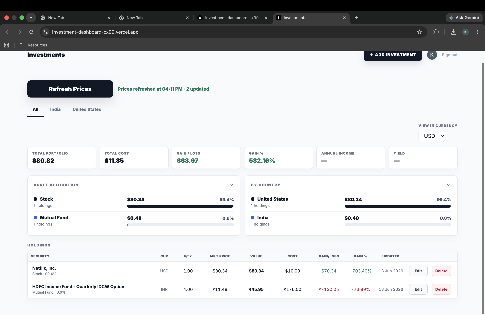
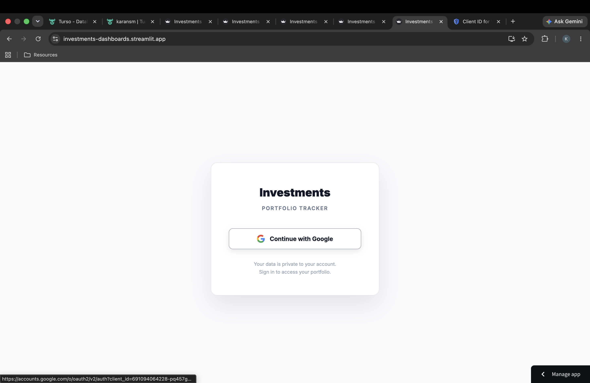
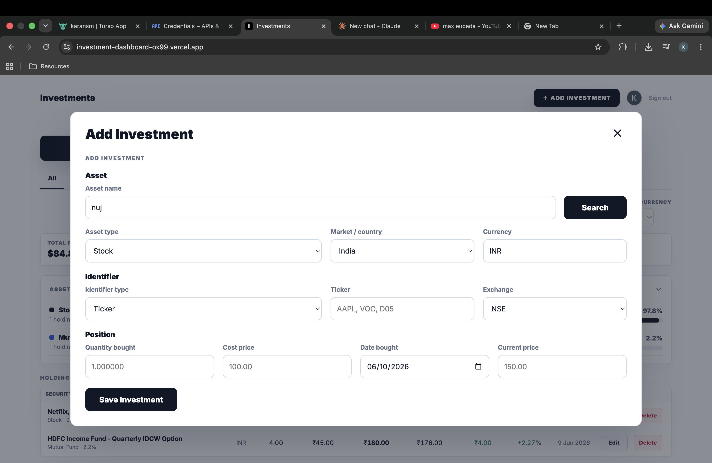
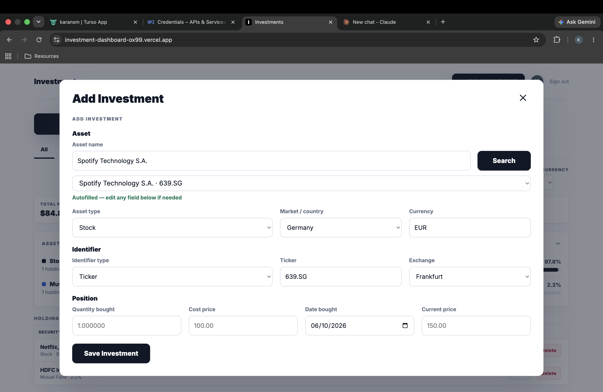
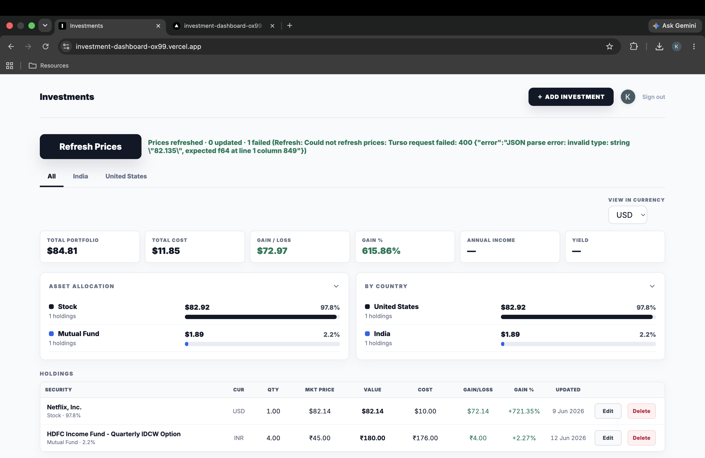

# Investment Dashboard

A fast, multi-user portfolio tracker for stocks, ETFs, and mutual funds. The app lets users sign in with Google, add holdings, refresh market prices, view portfolio allocation, and keep their investment data private to their own account.

[Live app](https://investment-dashboard-ox99.vercel.app/)



## Why This Project Stands Out

Investment Dashboard is built like a real personal finance product, not a static demo. It includes authenticated user accounts, persistent cloud storage, live price refreshes, global asset search, currency-aware portfolio views, and a production deployment on Vercel.

The app was rebuilt from an earlier Streamlit prototype into a responsive Next.js application to improve interaction speed, deployment quality, and user experience.

## Core Features

- Google sign-in so each user only sees their own portfolio.
- Add stocks, ETFs, and Indian mutual funds with ticker, ISIN, or scheme-code based identifiers.
- Current price autofill during add flow.
- Refresh live prices for auto-priced assets while keeping bonds, savings, and manual assets user-controlled.
- Portfolio summary with total value, total cost, gain/loss, gain percentage, annual income, and yield.
- Asset allocation and country allocation panels with collapsible sections.
- Currency-aware views across markets, including USD and INR.
- Inline row editing for quantity, cost, price, value, and purchase date.
- Clear refresh feedback showing when prices were refreshed and how many holdings updated.
- Cloud persistence through Turso/libSQL.

## Screens

### Login

Users must sign in before seeing any portfolio data.



### Dashboard

The main dashboard summarizes performance, allocation, country exposure, and holdings.


### Add Investment

The add flow searches for assets, autofills identifiers and market metadata, and lets users edit any field before saving.



### Inline Editing

Holdings can be edited directly in the table without opening a separate page.



### Refresh Diagnostics

Refresh feedback tells users what updated and flags provider or database issues instead of failing silently.



## Tech Stack

| Area | Technology |
| --- | --- |
| Frontend | Next.js, React, TypeScript |
| Styling | Custom CSS with responsive dashboard layouts |
| Auth | Google OAuth 2.0, signed HTTP-only session cookie |
| Database | Turso/libSQL |
| Deployment | Vercel |
| Market Data | Yahoo Finance chart endpoints, Nasdaq quote API, mfapi.in |
| Currency | Live FX conversion with local fallback rates |

## Architecture

```text
User
  -> Next.js UI
  -> API routes
  -> Google OAuth for identity
  -> Turso/libSQL for user-scoped portfolio data
  -> Quote providers for live prices
```

Key design choices:

- User data is scoped by Google user id at the database layer.
- Refreshes run server-side so provider logic and database writes are not exposed to the browser.
- Stock and ETF refreshes race multiple quote providers, then choose the freshest result.
- Mutual fund refreshes use mfapi's latest NAV endpoint first to avoid downloading full history.
- The UI updates from the refresh response immediately, so users do not need a full page reload.

## Performance Work

Recent refresh optimizations:

- Fixed Turso float encoding so refreshed prices save correctly in production.
- Reduced stock/ETF refresh latency by running quote providers in parallel.
- Preserved accuracy by selecting the newest available quote date instead of blindly taking the first response.
- Reduced mutual fund refresh latency by using the latest-NAV endpoint before falling back to full NAV history.
- Returned updated securities directly from the refresh API so the UI can update immediately.

Local production-mode verification:

| Action | Result |
| --- | --- |
| Add stock | 0.64s |
| Add mutual fund | 0.01s |
| Search asset | 0.18s |
| Stock price autofill | 0.82s |
| Mutual fund price autofill | 0.19s |
| Edit/save holding | 0.01s |
| Refresh 1 stock + 1 mutual fund | 1.53s, 2 updated, 0 failed |

## Run Locally

```bash
npm install
npm run dev
```

For local auth bypass during development:

```bash
DEV_AUTH=1 npm run dev
```

## Environment Variables

Create `.env.local` for local development or configure these in Vercel:

```bash
TURSO_DATABASE_URL=libsql://your-database.turso.io
TURSO_AUTH_TOKEN=your_turso_token
GOOGLE_CLIENT_ID=your_google_client_id
GOOGLE_CLIENT_SECRET=your_google_client_secret
AUTH_COOKIE_SECRET=your_long_random_secret
APP_URL=https://your-vercel-url.vercel.app
```

Google OAuth callback:

```text
https://your-vercel-url.vercel.app/api/auth/callback
```

## Deploy

The production app is deployed on Vercel from the `main` branch.

```bash
npm run build
git push origin main
```

Vercel automatically creates a production deployment when `main` is pushed.

## Project Status

The app is deployed and usable as a multi-user portfolio tracker. Current focus areas are expanding provider coverage for more global exchanges, improving provider diagnostics, and adding optional portfolio import/export.
