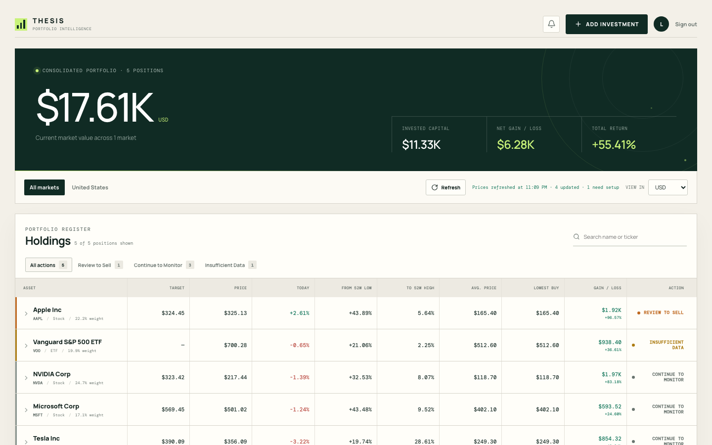

# Thesis

I track my stocks in an Excel sheet with a bunch of formulas (target price, 52-week high/low, how much I'm willing to put into each position) that tell me whether to buy, sell, or just hold. Updating it by hand was too manual, so I rebuilt it as a website that pulls live prices and runs the same rules automatically.

[Live app](https://investment-dashboard-ox99.vercel.app/)



## What it does

- Sign in with Google, everyone only sees their own stuff
- Add stocks, ETFs, or mutual funds by ticker, ISIN, or scheme code
- You can log separate purchases (lots) of the same stock instead of it averaging everything into one blob
- Live prices from Yahoo Finance, with a couple backup providers if that's down, plus it refreshes itself once a day even if you never open the app
- Spits out Buy / Review to Buy / Continue to Monitor / Review to Sell / Sell for each holding, using the same target-price / 52-week-range / allocation rules as my spreadsheet
- Keeps a log of when a recommendation actually changed, not just what it currently is
- Kind of a side feature: it can pull a company's SEC filing and check whether it actually backs up the reason you wrote down for owning the stock. Doesn't touch the real buy/sell logic at all, just sits next to it

## Stack

Next.js + TypeScript on the frontend, Turso (it's SQLite but hosted) for the database, Google OAuth for login, deployed on Vercel.

## Running it locally

```bash
git clone https://github.com/ksm0712/investment-dashboard.git
cd investment-dashboard
npm install
cp .env.example .env.local
```

You need a Turso database (free tier works, [turso.tech](https://turso.tech)) and a Google OAuth client. Put those in `.env.local`. Everything else in `.env.example` is optional.

```bash
npm run dev
```

Don't want to set up Google OAuth just to poke around locally? Run `DEV_AUTH=1 npm run dev` instead. It logs you in as a fake local user so you don't need OAuth.

If you want to see how the buy/sell math actually maps to the spreadsheet, that's written up in [docs/portfolio-intelligence.md](docs/portfolio-intelligence.md). I also did a whole performance pass on this (caching, retries, load testing). That's in [BENCHMARKS.md](BENCHMARKS.md) and [ENGINEERING_LOG.md](ENGINEERING_LOG.md) if that's your kind of thing.
