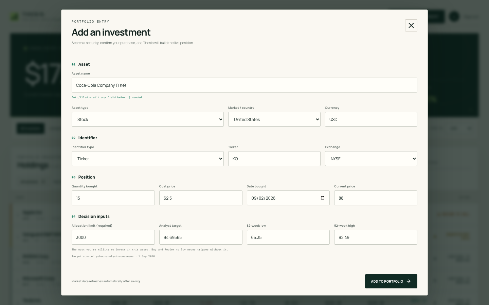
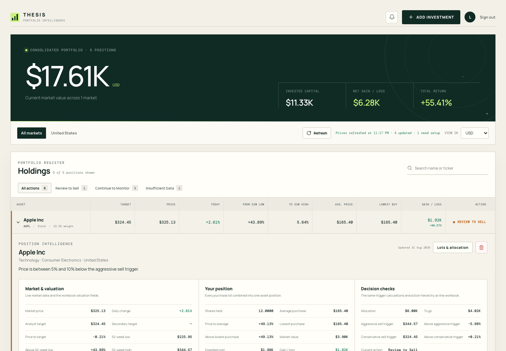

# Investment Dashboard

A fast, multi-user portfolio tracker for stocks, ETFs, and mutual funds. The app lets users sign in with Google, add holdings, refresh market prices, view portfolio allocation, and keep their investment data private to their own account.

[Live app](https://investment-dashboard-ox99.vercel.app/)


## Why This Project Stands Out

Investment Dashboard is built like a real personal finance product, not a static demo. It includes authenticated user accounts, persistent cloud storage, live price refreshes, global asset search, currency-aware portfolio views, and a production deployment on Vercel.

The app was rebuilt from an earlier Streamlit prototype into a responsive Next.js application to improve interaction speed, deployment quality, and user experience.

## Core Features

- Google sign-in so each user only sees their own portfolio.
- Add stocks, ETFs, and Indian mutual funds with ticker, ISIN, or scheme-code based identifiers.
- Current price, 52-week range, and analyst-target autofill during add flow.
- One consolidated row per asset with expandable spreadsheet-equivalent investment intelligence.
- Multiple purchase lots per asset, including lot-level dates, quantities, prices, and fees.
- Automatic average cost, lowest purchase, remaining allocation, trigger, and gain calculations.
- Auditable Buy, Review to Buy, Continue, Review to Sell, Sell, and Insufficient Data actions.
- A decision center with action counts, one-click action filters, holding search, and data-freshness badges.
- Persistent action history that records the price, target, source, reason, and previous recommendation only when an action changes.
- Secure daily portfolio refreshes through Vercel Cron, with manual refresh still available on demand.
- Refresh live prices for auto-priced assets while keeping bonds, savings, and manual assets user-controlled.
- Portfolio summary with total value, total cost, gain/loss, gain percentage, annual income, and yield.
- Asset allocation and country allocation panels with collapsible sections.
- Currency-aware views across markets, including USD and INR.
- Editable strategy settings and purchase lots without duplicating the asset.
- Clear refresh feedback showing when prices were refreshed and how many holdings updated.
- A per-holding investment thesis and AI evidence signal that stays separate from the numerical Buy/Sell engine.
- Automatic SEC 10-K/10-Q/20-F/40-F ingestion for U.S. stocks, with pasted-report support for other assets.
- Hybrid BM25/embedding retrieval, schema-validated model output, source citations, content-hash caching, and daily request limits.
- Cloud persistence through Turso/libSQL.

## Screens

### Login

Users must sign in before seeing any portfolio data.


### Dashboard

The main dashboard summarizes performance, allocation, country exposure, and holdings.


### Add Investment

The add flow searches for assets, autofills identifiers and market metadata, and lets users edit any field before saving.



### Inline Editing

Holdings can be edited directly in the table without opening a separate page.



### Refresh Diagnostics

Refresh feedback tells users what updated and flags provider or database issues instead of failing silently.


## Tech Stack

| Area | Technology |
| --- | --- |
| Frontend | Next.js, React, TypeScript |
| Styling | Custom CSS with responsive dashboard layouts |
| Auth | Google OAuth 2.0, signed HTTP-only session cookie |
| Database | Turso/libSQL |
| Deployment | Vercel |
| Market Data | Yahoo Finance, Nasdaq, FMP, Twelve Data, Alpha Vantage, mfapi.in |
| Currency | Live FX conversion with local fallback rates |

## Architecture

```text
User
  -> Next.js UI
  -> API routes
  -> Google OAuth for identity
  -> Turso/libSQL for user-scoped portfolio data
  -> Quote providers for live prices, ranges, and targets
  -> Pure decision engine for derived metrics and actions
  -> Action history for recommendation transitions
  -> Vercel Cron for daily automatic recalculation
```

Key design choices:

- User data is scoped by Google user id at the database layer.
- Assets and purchase lots are separate records: market intelligence belongs to the asset; cost history belongs to its lots.
- All Excel-derived formulas and action precedence live in one tested calculation engine.
- Action history is event-based rather than snapshot-based, so unchanged recommendations do not create duplicate records.
- Refreshes run server-side so provider logic and database writes are not exposed to the browser.
- Stock and ETF refreshes race multiple quote providers, then choose the freshest result.
- Mutual fund refreshes use mfapi's latest NAV endpoint first to avoid downloading full history.
- The UI updates from the refresh response immediately, so users do not need a full page reload.
- The language model never receives or changes the deterministic portfolio action. It reads retrieved report passages and independently labels the saved thesis as Supported, Unclear, or Contradicted.
- Filing text is treated as untrusted data, citations are limited to retrieved passage IDs, and invalid structured output is rejected before persistence.

## AI Evidence Research

Expand a holding, save the reason you own it, and run **AI evidence research**. For U.S. stocks the server can download the latest supported SEC filing automatically; for other holdings, paste a filing, earnings release, or company report. The result appears beside the numerical engine so a cheap-looking asset can still surface a deteriorating business thesis without allowing a model to overwrite the tested formula.

The zero-cost local path uses Ollama:

```bash
ollama pull llama3.2
ollama pull nomic-embed-text
AI_PROVIDER=ollama DEV_AUTH=1 npm run dev
```

The fixed 30-case synthetic evaluation set runs through the real local model and hybrid retriever:

```bash
AI_PROVIDER=ollama npm run ai-eval
```

Final measured results on `llama3.2`: **100% Recall@5, 100% schema validity, 100% evidence-signal accuracy, 100% risk-label accuracy, and 86.8% citation precision**. p50/p95 end-to-end inference latency was **10,941/15,123 ms** with an average **1,514 input + 322 output tokens**. Exact cases, command, and raw output are recorded in [BENCHMARKS.md](BENCHMARKS.md); design decisions and first-run failures are in [ENGINEERING_LOG.md](ENGINEERING_LOG.md).

For a public Vercel demo, set `AI_PROVIDER=groq` and `GROQ_API_KEY` as server-only environment variables. The application limits uncached requests per user, caches identical analysis inputs, and returns a clear unavailable state when no provider is configured instead of presenting deterministic text as AI output.

## Engineering

A full measured performance/reliability pass — every number below comes from a real run of a script in `scripts/`, recorded in **[BENCHMARKS.md](BENCHMARKS.md)** with the exact command, raw output, and before/after comparison. The reasoning behind each decision (alternatives considered, tradeoffs, what broke and how it was diagnosed) is in **[ENGINEERING_LOG.md](ENGINEERING_LOG.md)**.

**Cache strategy** — `lib/quote-cache.ts` implements stale-while-revalidate directly (no caching library) over a `quote_cache` table, keyed by symbol so multiple users holding the same stock share one fetch. TTL varies by market state via `lib/market-status.ts` (60s open / 15min closed / 12h weekend, all env-tunable): fresh reads never touch a provider; stale reads serve immediately and kick a deduplicated background refresh (an in-flight `Map` ensures concurrent stale reads for the same symbol trigger exactly one fetch); missing reads fetch synchronously. **Result: warm-cache portfolio load latency dropped 96% (473ms → 18ms) and external API calls per load dropped 100% (100 → 0)** on a 20-holding fixture.

**Concurrency model** — `refreshPrices()` fans out over holdings with a bounded worker pool, now tunable via `REFRESH_CONCURRENCY` (default 5) instead of a hardcoded value. Each holding itself races 5 keyless market-data providers (Yahoo, FMP, Nasdaq, plus fallbacks) in parallel and takes the richest response. US-listed holdings' FMP quotes are prefetched in one batched request before the per-holding loop starts, so covered symbols skip that provider's leg of the race entirely.

**Failure handling** — `lib/resilient-fetch.ts` wraps every provider call with retry (exponential backoff + jitter, capped attempts and a time ceiling, honoring `Retry-After`) and a circuit breaker that opens after repeated consecutive failures and serves cached/other-provider data instead of hammering a down upstream. **Result: security-level refresh failure rate under a 100-run chaos test (30% simulated provider throttling) dropped from 3.6% (no retry) to 0.0%** (retry + circuit breaker), with 0% user-visible errors in both — a failed refresh always falls back to the last known price with a visible "as of" timestamp, never a blank.

**Database** — Turso/libSQL, with composite indexes added on the columns queries actually filter by (not just the joined foreign key — see `ENGINEERING_LOG.md` Phase 4 for a single-index dead end this caught). Reduced the slowest query's rows read from 98 to 42, and a parallel lot-accounting join from 137 to 81, on the same fixture.

**Load test** — a local `next build && next start` comparison against the pre-optimization commit, ramping 1/10/50/100 concurrent users against the live-data path. At 50 concurrent users, the pre-optimization build completes **zero** of 150 attempted requests in 30 seconds; the optimized build completes 87.4% of its (degraded but real) requests. Neither build sustains sub-500ms p99 at real concurrency — this app's data-load path races 5 external providers per holding, and no amount of application-side work removes that ceiling — but Phases 1-3 turn what was a hard collapse under load into a degraded-but-serving one.

Every environment-tunable knob (cache TTLs, concurrency cap, retry limits, circuit breaker thresholds, FMP batch size) is an env var with a sensible default — see `.env.example`.

## Performance Work

Recent refresh optimizations:

- Fixed Turso float encoding so refreshed prices save correctly in production.
- Reduced stock/ETF refresh latency by running quote providers in parallel.
- Preserved accuracy by selecting the newest available quote date instead of blindly taking the first response.
- Reduced mutual fund refresh latency by using the latest-NAV endpoint before falling back to full NAV history.
- Returned updated securities directly from the refresh API so the UI can update immediately.

Local production-mode verification:

| Action | Result |
| --- | --- |
| Add stock | 0.64s |
| Add mutual fund | 0.01s |
| Search asset | 0.18s |
| Stock price autofill | 0.82s |
| Mutual fund price autofill | 0.19s |
| Edit/save holding | 0.01s |
| Refresh 1 stock + 1 mutual fund | 1.53s, 2 updated, 0 failed |

## Run Locally

```bash
npm install
npm run dev
```

For local auth bypass during development:

```bash
DEV_AUTH=1 npm run dev
```

## Environment Variables

Create `.env.local` for local development or configure these in Vercel:

```bash
TURSO_DATABASE_URL=libsql://your-database.turso.io
TURSO_AUTH_TOKEN=your_turso_token
TWELVE_DATA_API_KEY=your_twelve_data_key
FMP_API_KEY=your_financial_modeling_prep_key
ALPHA_VANTAGE_API_KEY=your_alpha_vantage_key
GOOGLE_CLIENT_ID=your_google_client_id
GOOGLE_CLIENT_SECRET=your_google_client_secret
AUTH_COOKIE_SECRET=your_long_random_secret
CRON_SECRET=your_long_random_cron_secret
APP_URL=https://your-vercel-url.vercel.app
AI_PROVIDER=groq
GROQ_API_KEY=your_free_hosted_inference_key
AI_DAILY_REQUEST_LIMIT=10
SEC_USER_AGENT=Thesis portfolio research your-email@example.com
```

Yahoo Finance is the no-key global source for prices, 52-week ranges, and analyst targets. FMP, Nasdaq, Twelve Data, and Alpha Vantage remain automatic fallbacks. The app records which provider supplied each target.

The included Vercel schedule refreshes every auto-priced account daily at 02:00 UTC / 10:00 Singapore time. Vercel sends `CRON_SECRET` as a bearer token so the endpoint cannot be triggered publicly. Vercel Hobby supports this once-daily schedule; paid plans can increase the frequency later.

Google OAuth callback:

```text
https://your-vercel-url.vercel.app/api/auth/callback
```

## Deploy

The production app is deployed on Vercel from the `main` branch.

```bash
npm run build
git push origin main
```

Vercel automatically creates a production deployment when `main` is pushed.

## Project Status

The feature branch now includes the complete spreadsheet-equivalent decision layer, global target and market-data sourcing, purchase lots, action filtering, persistent recommendation history, freshness indicators, and scheduled daily refresh. The production `main` branch remains unchanged until this work is reviewed and merged.
