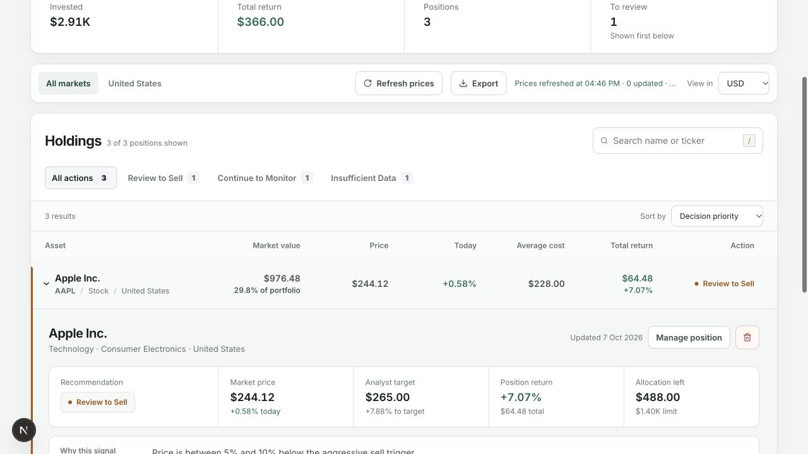
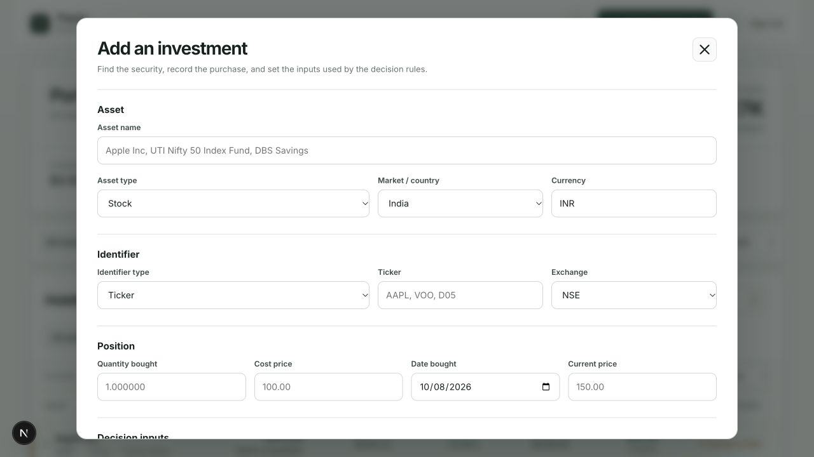

# Thesis


Thesis is the portfolio tracker I wanted while I was still managing my investments in a spreadsheet. It keeps purchase lots, allocation limits, analyst targets, and market data in one place, then applies a fixed set of rules to show which positions may need attention.

The app is live at **[thesis-karan.vercel.app](https://thesis-karan.vercel.app/)**.


## Why I built it

My original spreadsheet worked, but maintaining it did not. Each price update was manual, multiple purchases of the same stock were easy to flatten into one number, and it was difficult to tell why a position had moved from “monitor” to “review.”

I rebuilt that workflow as a private web app with three goals:

1. Keep the calculations reproducible.
2. Keep every purchase lot and data source auditable.
3. Put the positions that need a decision ahead of the ones that do not.

## How the product works

### 1. Build the position

Search for a stock, ETF, or mutual fund and record the purchase quantity, cost, date, and allocation limit. Additional purchases are stored as separate lots and consolidated into one position.

### 2. Refresh the market inputs

Thesis stores the current price, daily change, 52-week range, analyst target, source, and observation date when those fields are available. A daily Vercel job refreshes saved positions, and the same refresh can be run manually from the portfolio.

### 3. Calculate the recommendation

The decision engine evaluates the current price against the target, 52-week high, lowest purchase price, and remaining allocation. It produces one mutually exclusive result:

- **Buy**
- **Review to Buy**
- **Continue to Monitor**
- **Review to Sell**
- **Sell**
- **Insufficient Data**

The recommendation is deterministic: the same inputs always produce the same output. The formulas and their evaluation order are documented in [docs/portfolio-intelligence.md](docs/portfolio-intelligence.md).

### 4. Review the position

Opening a holding starts with the recommendation, the numbers that matter to it, and a short explanation. Detailed valuation data, purchase accounting, thesis evidence, and decision history are available in separate disclosure sections instead of being shown all at once.



### 5. Test the written thesis

For an eligible U.S. company, Thesis can retrieve the latest SEC filing and compare relevant passages with the claims in a saved investment thesis. The result identifies supporting evidence, contradictions, and gaps, with citations back to the retrieved filing sections.

This evidence review is deliberately separate from the numerical recommendation. Model output cannot change a Buy or Sell result. The retrieval and validation flow is described in [docs/ai-research-architecture.md](docs/ai-research-architecture.md).

## Current features

- Private, per-user portfolios through Google OAuth
- Stocks, ETFs, mutual funds, bonds, savings, and other manually priced assets
- Separate purchase lots with quantity, cost, fees, and purchase date
- Consolidated cost basis, market value, gain/loss, allocation remaining, and trigger distances
- Market and analyst data with source and freshness information
- Search, action filters, decision-priority sorting, market filters, and currency display
- CSV export of the active portfolio view
- Recommendation history recorded only when the action changes
- SEC filing retrieval, claim-level evidence review, and source citations
- Quote caching, bounded refresh concurrency, retry handling, and provider fallbacks
- Responsive layouts for desktop and mobile

## Adding an investment

The form separates the security identifier, purchase details, and decision inputs. Search results fill the fields that can be resolved safely; anything unavailable remains editable.



## Technical structure

```text
Next.js app
├── React portfolio interface
├── authenticated route handlers
├── deterministic portfolio engine
├── market-data refresh and quote cache
├── filing retrieval and evidence pipeline
└── Turso/libSQL persistence
```

The main application code lives in `app/`, calculations and integrations live in `lib/`, and repeatable benchmarks and evaluations live in `scripts/`.

| Area | Implementation |
|---|---|
| Web application | Next.js 16, React 19, TypeScript |
| Database | Turso / libSQL |
| Authentication | Google OAuth with an HTTP-only session cookie |
| Market data | Yahoo Finance with configured provider fallbacks |
| Filing evidence | SEC EDGAR, lexical or hybrid retrieval, validated structured output |
| Hosting | Vercel, including a daily refresh cron |

### Product identity

The Thesis mark is deliberately simple enough to remain legible in a browser tab: the `T` represents the written investment thesis, and the ochre point represents a decision backed by evidence. The scalable source is [`app/icon.svg`](app/icon.svg). [`app/favicon.ico`](app/favicon.ico) provides the 32 px browser fallback, and [`app/apple-icon.png`](app/apple-icon.png) is the 180 px home-screen version. Next.js discovers these files from the `app/` directory and adds versioned icon links to the page automatically.

## Run it locally

Node.js 22 or newer is recommended.

```bash
git clone https://github.com/ksm0712/investment-dashboard.git
cd investment-dashboard
npm install
cp .env.example .env.local
```

For a quick local run, keep `DEV_AUTH=1` and leave the Turso credentials blank. The app will use a local development identity and an in-memory database, so the data will reset when the server stops.

```bash
npm run dev
```

Open [http://localhost:3000](http://localhost:3000).

For persistent local data or a deployment, configure a Turso database. For real sign-in, remove `DEV_AUTH` and configure the Google OAuth fields below.

## Configuration

All supported variables and safe example values are in [.env.example](.env.example).

### Required in production

| Variable | Purpose |
|---|---|
| `TURSO_DATABASE_URL` | libSQL database URL |
| `TURSO_AUTH_TOKEN` | Database access token |
| `GOOGLE_CLIENT_ID` | Google OAuth client ID |
| `GOOGLE_CLIENT_SECRET` | Google OAuth client secret |
| `AUTH_COOKIE_SECRET` | Signs the session cookie |
| `APP_URL` | Public application origin |
| `CRON_SECRET` | Protects the scheduled refresh route |

### Optional integrations

| Variable | Purpose |
|---|---|
| `FMP_API_KEY` | Market-data and target fallback |
| `TWELVE_DATA_API_KEY` | Market-data fallback |
| `ALPHA_VANTAGE_API_KEY` | Market-data fallback |
| `AI_PROVIDER` | `ollama` for local inference or `groq` for the hosted demo |
| `GROQ_API_KEY` | Hosted evidence-analysis key |
| `SEC_USER_AGENT` | Contact identifier required for SEC requests |

Cache, retry, batching, and request-limit settings are optional and documented beside their defaults in [.env.example](.env.example).

## Checks

```bash
npm test
npm run typecheck
npm run lint
npm run build
```

The repository also includes targeted benchmark and evaluation commands:

```bash
npm run bench
npm run db-bench
npm run chaos-bench
npm run ai-eval
npm run load-test
```

Measured results are recorded in [BENCHMARKS.md](BENCHMARKS.md). Implementation decisions, failed approaches, and remaining limits are kept in [ENGINEERING_LOG.md](ENGINEERING_LOG.md).

## Deployment

The production app is deployed from `main` on Vercel. The required environment variables, OAuth callback, and verification steps are in [DEPLOYMENT.md](DEPLOYMENT.md).

## Scope

Thesis is a personal portfolio decision tool, not a brokerage and not financial advice. Recommendations depend on the supplied allocation and the availability of market and target data. Filing analysis is evidence retrieval and summarization; it is not a guarantee that a thesis is correct.
